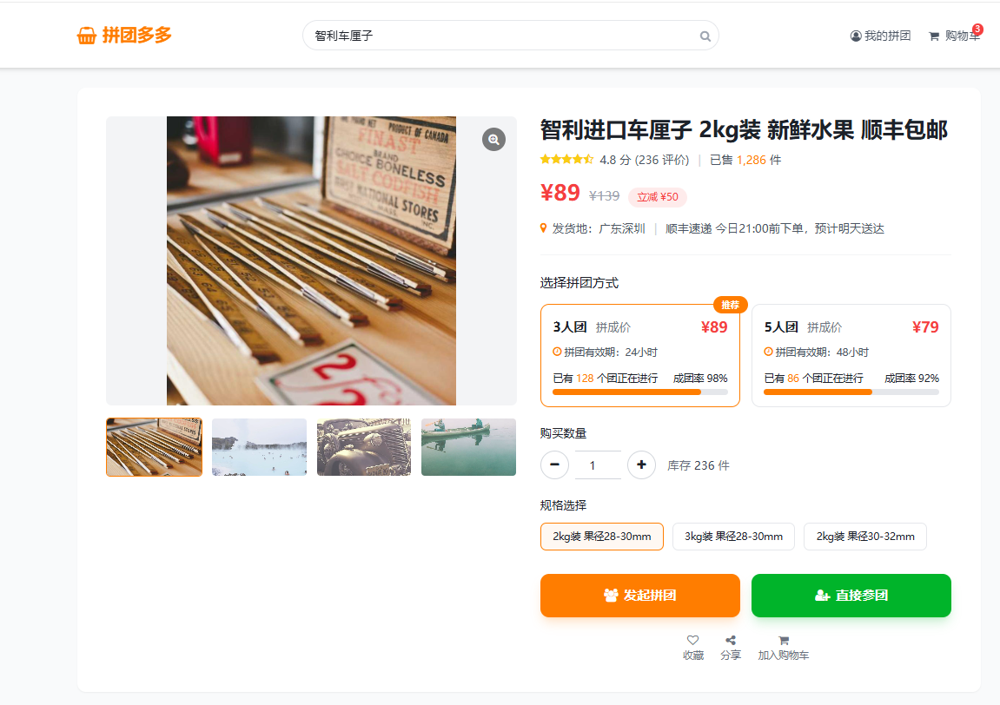

# 团购系统 (Group Buy System)

基于DDD领域驱动设计的企业级团购系统，采用六边形架构和多种设计模式构建，实现业务与技术的清晰分离。

## 📸 系统预览

<div align="center">
  
</div>

## 🏗️ 系统架构

### 核心设计理念
- **领域驱动设计 (DDD)**：以业务领域为核心，采用聚合根、实体、值对象的经典模式
- **六边形架构**：业务逻辑与技术实现完全解耦，确保系统的可维护性
- **模块化架构**：Maven多模块设计，每个模块职责单一且边界清晰

### 系统分层

```
group-buy/
├── group-buy-api/              # 接口定义层 - 对外契约定义
├── group-buy-app/              # 应用服务层 - 系统启动与配置
├── group-buy-domain/           # 领域核心层 - 业务逻辑与规则
├── group-buy-trigger/          # 适配器层 - 外部请求处理
├── group-buy-infrastructure/   # 基础设施层 - 技术实现细节
└── group-buy-types/           # 公共组件层 - 通用框架与工具
```

## 🛠️ 技术选型

### 基础框架
- **Spring Boot 2.7.12** - 应用框架
- **Java 8** - 开发语言
- **Maven** - 项目构建

### 持久化技术
- **MyBatis 2.1.4** - 数据访问框架
- **MySQL 8.0.22** - 主数据库
- **HikariCP** - 高性能数据库连接池
- **Redisson 3.26.0** - 分布式缓存与锁

### 消息中间件
- **RabbitMQ** - 异步消息处理
- **Spring AMQP** - 消息队列集成

### 核心依赖
- **FastJSON 2.0.28** - JSON处理
- **Google Guava 32.1.3-jre** - 工具集合
- **Apache Commons Lang3 3.9** - 通用工具
- **Lombok** - 代码增强

### 安全组件
- **JWT** - 身份认证
  - 标准JWT实现 (jjwt 0.9.1)
  - Auth0 JWT扩展 (java-jwt 4.4.0)

### 网络工具
- **OkHttp 4.9.3** - HTTP客户端
- **Commons Codec 1.15** - 编码解码工具

## 🎯 核心业务功能

### 拼团管理
- **开团机制**：支持用户发起拼团活动，设置目标人数和有效期
- **参团流程**：用户可加入已有拼团，系统自动处理库存锁定
- **进度跟踪**：实时查询拼团进度，包括已参与人数、锁单数量等

### 订单处理
- **订单锁定**：基于规则过滤链的订单锁定机制，支持风控检查
- **库存管理**：Redis缓存实现无锁化库存抢占，降低数据库压力
- **交易结算**：支付成功后自动触发结算流程，更新拼团状态

### 营销活动
- **活动配置**：支持多种营销活动类型和折扣策略
- **规则引擎**：动态配置活动参与规则和限制条件
- **效果追踪**：实时统计活动参与情况和转化效果

### 用户标签
- **标签管理**：用户行为标签的采集和管理
- **人群圈选**：基于标签的用户人群划分
- **精准营销**：标签驱动的个性化推荐

## 🎯 设计模式实践

### 责任链模式
构建了灵活的规则过滤体系，支持动态组装业务规则链条：
- **交易规则过滤**：`TradeLockRuleFilterFactory` 处理订单锁定规则
- **结算规则过滤**：`TradeSettlementRuleFilterFactory` 处理交易结算规则
- **库存规则过滤**：`TeamStockOccupyRuleFilter` 处理拼团库存校验

### 策略模式
活动处理采用策略模式设计，支持不同类型活动的差异化处理逻辑：
- **活动策略工厂**：`DefaultActivityStrategyFactory` 动态选择处理策略
- **节点策略**：`MarketNode`、`SwitchNode`、`ErrorNode` 等处理不同业务节点
- **多线程策略路由器**：支持异步数据预加载

### 工厂模式
各类业务对象通过工厂模式创建，统一管理对象的生命周期和依赖关系，确保扩展性和可维护性。

## 🏛️ 领域模型设计

### 聚合设计
聚合作为业务一致性边界，封装了核心业务逻辑：
- **团购订单聚合**：`GroupBuyOrderAggregate` 管理订单完整生命周期
- **拼团队伍聚合**：`GroupBuyTeamEntity` 管理拼团状态和人员

### 实体建模
实体对象承载业务属性和行为：
- **交易实体**：`MarketPayOrderEntity`、`TradePaySettlementEntity`
- **活动实体**：`GroupBuyActivityEntity`、`PayActivityEntity`
- **用户实体**：`UserEntity`、`CrowdTagsJobEntity`

### 业务领域划分
系统按业务职责划分为三个核心领域：
- **Activity** - 营销活动管理：活动配置、规则管理、效果统计
- **Trade** - 交易订单处理：订单锁定、支付结算、库存管理
- **Tag** - 用户标签体系：标签采集、人群圈选、精准营销

## 🔧 技术亮点

### 高性能架构
- **无锁化库存**：Redis缓存实现库存抢占，避免数据库行锁
- **异步处理**：多线程策略路由器支持异步数据预加载
- **连接池优化**：HikariCP高性能数据库连接池

### 分布式特性
- **分布式锁**：Redisson实现分布式锁和缓存
- **消息驱动**：RabbitMQ异步消息处理和事件通知
- **多环境支持**：dev、test、prod环境隔离配置

### 容器化支持
- **Docker镜像**：提供标准化Docker镜像构建
- **环境隔离**：支持不同环境的容器化部署
- **健康检查**：集成Spring Boot Actuator监控

## 📋 开发规范

### 对象命名规则
- 聚合对象：`XxxAggregate`
- 实体对象：`XxxEntity`  
- 值对象：`XxxVO`
- 工厂类：`XxxFactory`
- 服务类：`XxxService` / `XxxServiceImpl`
- 过滤器：`XxxRuleFilter`

### 模块依赖管理
严格控制模块间的依赖关系：
- **Domain层**：保持业务纯净性，只依赖Types层
- **Infrastructure层**：实现技术细节，可依赖Domain和Types层
- **App层**：负责整体组装，依赖所有其他层
- **Types层**：提供通用能力，不依赖其他层

## 🚀 快速开始

### 环境要求
- **JDK 8+**
- **Maven 3.6+**
- **MySQL 8.0+**
- **Redis 6.0+**
- **RabbitMQ 3.8+**

### 本地运行
1. **启动基础服务**
   ```bash
   # 启动 MySQL (端口 3306)
   # 启动 Redis (端口 6379) 
   # 启动 RabbitMQ (端口 5672)
   ```

2. **导入数据库**
   ```bash
   # 创建数据库 group_buy_market
   # 执行 SQL 脚本初始化表结构
   ```

3. **修改配置**
   ```yaml
   # 修改 application-dev.yml 中的数据库和中间件连接信息
   ```

4. **启动应用**
   ```bash
   mvn clean install
   cd group-buy-app
   mvn spring-boot:run
   ```

### Docker部署
```bash
# 构建镜像
cd group-buy-app
./build.sh

# 运行容器
docker run -d \
  --name group-buy-app \
  -p 8091:8091 \
  -e SPRING_PROFILES_ACTIVE=prod \
  system/group-buy-app:1.0-SNAPSHOT
```

### 访问地址
- **应用服务**：http://localhost:8091
- **健康检查**：http://localhost:8091/actuator/health 